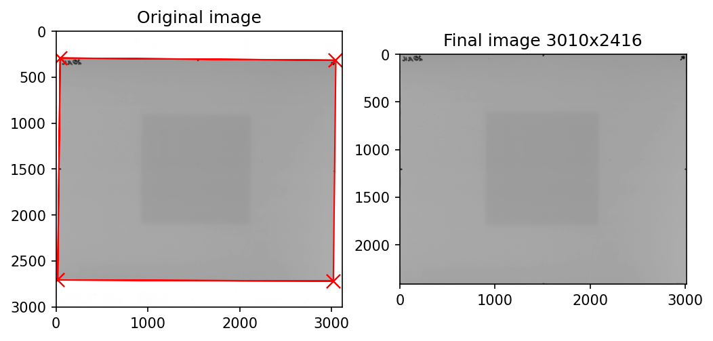

# Corner Register

A Python framework to register scanned films.

For each scan, the film corners are identified assuming plain white background. 

The image is rotated so that the line connecting the top two corners is flat.

The image is cropped to the rotated corners, then stored as a 2D numpy array in the list 'films'.

# Getting started

Use the 'get_films()' function to return a list of cropped and rotated films. Example output:

